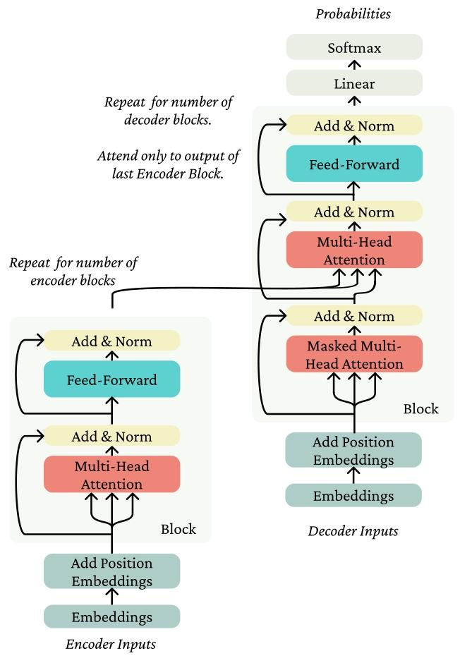

---
head:
  - - link
    - rel: stylesheet
      href: https://cdnjs.cloudflare.com/ajax/libs/KaTeX/0.5.1/katex.min.css
---

# 自注意力机制与 Transformer

循环神经网络存在着难以并行、难以捕捉长距离依赖等问题，2017年后，注意力机制和Transformer模型被提出，逐渐成为自然语言处理的主流模型。

## 键-查询-值自注意力机制

注意力机制，简单的认为就是接收一个查询，寻找最为接近的一个键，然后返回对应的值。这里为什么为什么要区分键和值，很大程度上只是实践中发现这样效果更好。这里所说的最为接近，往往不是贪心的最接近，而是通过计算加权和得到。

对于序列中的一个词，我们通过词嵌入模型得到其向量，这个向量与一个查询矩阵作矩阵乘法得到查询向量，而与序列中每一个单词的键向量（与查询向量类似方法得到）作点乘，得到其相似程度，再通过softmax得到权重，即为注意力，最后将权重与值向量作加权求和得到输出向量，即为其上下文表示。

在实际中，这里的很多矩阵乘法都是并行的，即把词向量排列为一个矩阵进行运算，而不是对每一个向量逐一计算。重新考察发现，假设序列的长度为 $n$ ，而词向量的维度为 $d$ ，一般地我们令查询矩阵、键矩阵和值矩阵大小为 $n\times n$ ，从而我们得到的查询向量组成的矩阵、键向量组成的矩阵和值向量组成的矩阵维度均为 $n\times d$ ，而点乘应为查询向量组成的矩阵与键向量组成的矩阵的转置相乘，得到的注意力矩阵维度为 $n\times n$ ，注意力矩阵与值向量组成的矩阵相乘，得到上下文表示的矩阵维度为 $n\times d$ 。

上面的自注意力机制事实上没有位置表示，我们可以在词嵌入层中加入位置嵌入。

在预测工作中，我们需要添加掩码，使得注意力矩阵中，前面的单词对尚未出现的单词注意力为 $0$ 或者也可以作负无穷。

实际工作中，我们在 Softmax 操作前，往往会将每一个点乘结果先除以 $\sqrt{d}$ ，使得点乘的结果更加稳定。

## Transformer

> Transformer 是一种基于自注意力的架构，由堆叠的模块（Block）组成，每个模块都包含自注意力层和前馈层，以及一些我们将讨论的其他组件。

（取自[讲义](https://web.stanford.edu/class/archive/cs/cs224n/cs224n.1246/readings/cs224n-self-attention-transformers-2023_draft.pdf )的翻译，翻译由[豆包大模型](https://www.doubao.com/chat/)给出）

### 多头注意力机制

注意我们上面提到的自注意力机制中，我们需要进行 Softmax 操作，这很耗时，我们可以引入多头注意力（当然，其作用不仅仅在于此），即我们将多组查询向量、键向量和值向量进行自注意力计算，然后将每组的输出向量拼接起来，再通过一个线性层得到最终的输出向量。具体的，如果我们有 $k$ 个注意力头，则我们需要 $k$ 组查询向量、键向量和值向量，每组的大小为 $n\times d/k$ ，每组的输出向量大小为 $n\times d/k$ ，最终的输出向量大小为 $n\times d$ 。事实上总的计算量是不变的，但被分散到了每一个注意力头上，从而可以进行并行化。

### 层归一化

归一化在神经网络中有着广泛的应用，在 Transformer 架构中，常用的是层归一化。在卷积神经网络中，常用的是批量归一化，一般的卷积层的批归一化是在每一个通道上进行归一化，可以取得比较好的效果，但在循环神经网络或 Transformer 网络，一般没有通道的概念，且输入总和往往随序列长度而变化，故一般使用层归一化。实际操作中，即对输入的序列的词向量求平均值和方差（均为向量），进行归一化。

### 残差连接

残差链接一般和层归一化一起作为一个组件使用，称为 Add & Norm 。有先归一化与后归一化两种类型。 Add & Norm 层一般加在多注意头之后和前馈层之后。

### 注意力对数几率缩放

其实就是上面提到的需要除以 $`\sqrt{d}`$ 的操作。

### Transformer 编码器

根据上面的内容，我们很容易得到 Transformer 编码器的结构。一般地，编码器接受一个序列的输入，使用词嵌入模型得到其词向量，然后使用多头注意力机制得到其上下文表示，再使用残差连接和层归一化，最后使用前馈层得到其输出向量。编码器不需要进行未来掩码。

### Transformer 解码器

解码器与编码器的结构完全一样，除了需要进行未来掩码。

### Transformer 编码器-解码器

Transformer 编码器-解码器接收两个序列的输入，编码器接受一个序列的输入，解码器接受另一个序列的输入。在进行一般的编码器和解码器的操作后，会再进行交叉注意，即编码器的输出向量和解码器的输出向量进行自注意力计算，然后再使用残差连接和层归一化，最后使用前馈层得到其输出向量。其一般地结构如下

