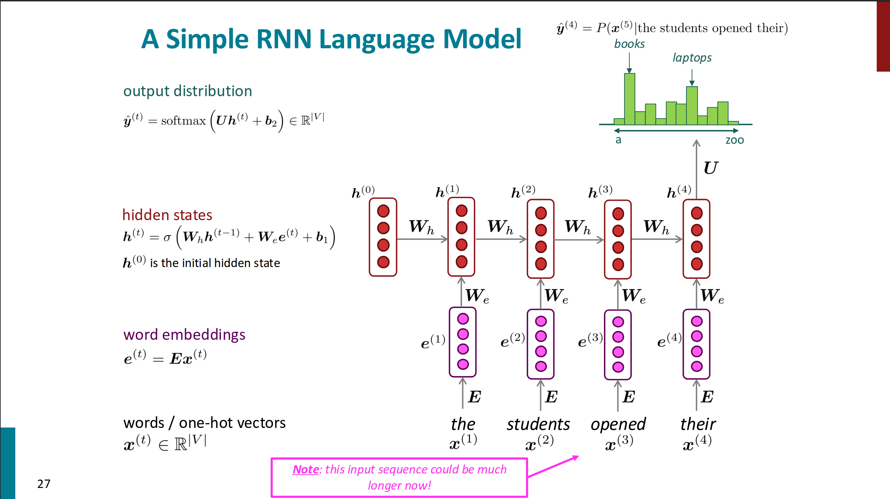

---
head:
  - - link
    - rel: stylesheet
      href: https://cdnjs.cloudflare.com/ajax/libs/KaTeX/0.5.1/katex.min.css
---

# 神经机器翻译

这里主要是对神经机器翻译的一些理解，主要基于[cs224n](https://web.stanford.edu/class/cs224n/)第六、八讲的笔记，参考的中文资料为[文章](https://juejin.cn/post/7095181203929563173)和[文章](https://juejin.cn/post/7095946235848163364)。

## 语言模型

语言模型即根据当前的一个词语序列预测下一个词语的概率分布的模型。

### n-gram 语言模型

n-gram 即 n 个连续的单词形成的词块。我们假设一个单词出现的概率仅与前面 n-1 个单词相关，即我们预测下一个单词为 $w_{t+1}$ 的概率为

$$
P(w_{t}|w_{t-1},w_{t-2},\cdots,w_{t-n+1}) = \frac{P(w_{t},w_{t-1},w_{t-2},\cdots,w_{t-n+1})}{P(w_{t-1},w_{t-2},\cdots,w_{t-n+1})}
$$

即一个 n-gram 出现的概率除以一个 (n-1)-gram 出现的概率。

n-gram 语言模型会面临稀疏性的问题，即你需要查询的 n-gram 可能在语料库中没有出现过，此时就会导致概率为 0，为处理这个问题，我们对此进行回退处理，即退化为 (n-1)-gram 问题，并乘以惩罚系数，乘法系数取得方法为：我们需要给那些没有在训练集出现的gram一定的概率，即做平滑处理，而后令训练集出现的词和未见的词之条件概率和为 $1$ ，即可求之。更为具体的可以参考[知乎文章](https://zhuanlan.zhihu.com/p/528766700)。

使用 n-gram 模型需要存储语料库中所有的 n-gram 的出现次数，当 n 增大时，模型的大小也会增大。

### 固定窗口的神经语言模型

我们也可以用神经网络来搭建语言模型，一个常见的就是固定窗口的神经语言模型。具体的方法就是对于固定大小的窗口中的所有词汇的词向量组成矩阵，通过一个带有一个隐藏层的线性神经网络来预测下一个单词的概率分布。这很好的避免了稀疏性的问题，并且不用存储所有的 n-gram ，但这样的模型使得扩大窗口大小就需要增加权重矩阵的大小，而窗口再大也常不足以很好的预测下一个单词。

### 循环神经网络(RNN)

循环神经网络定义的语言模型简单的说就是对于一个任意长的序列，其下一个单词的概率由最后一个单词及其之前的单词（包含最后一个单词）共同决定，而之前的单词（包括最后一个单词）由隐状态表示，隐状态的计算由当前的单词和上一个隐状态共同决定，即递归的方式。

具体的理解，可以参考[课件](https://web.stanford.edu/class/cs224n/slides_w25/cs224n-2025-lecture05-rnnlm.pdf)第27页（侵删）

即对于输入序列的每一个单词，我们通过词嵌入得到其向量表示，同时我们将这个向量与上一个隐状态拼接起来，通过一个线性层得到当前的隐状态，对于第一个隐状态，一般由设计者自行初始化，可以全为 $0$ ，TensorFlow 和 Pytorch似乎都是这样做的，参考[知乎回答](https://www.zhihu.com/question/384725029/answer/1124300180)。对于输出的概率分布，一般采用最后一个状态通过一个线性层得到。

循环神经网络的训练可以通过梯度累加的方法，对于语料库中每一个单词预测其概率分布，并于实际的独热向量求交叉熵损失，将所有的损失求和平均即为总的损失，反向传播的时候将每一个时间步得到的参数的梯度加起来，即得参数总的梯度，这种方法称为"backpropagation through time"。实际操作的时候，我们往往不会将整个语料库遍历，而会选择一个句子（一批句子）或者一个文档作为一个序列。

## 机器翻译模型

语言模型的任务是预测下一个单词，而机器翻译则是预测对应的句子。

### 统计机器翻译

具体的可以参考[文章](https://juejin.cn/post/7095946235848163364)中的对应内容，或者参考课件。

### 神经网络机器翻译

神经机器翻译是指利用一个神经网络进行机器翻译的工作，这个神经网络被称为 sequence-to-sequence ，包括两个RNN网络，一般地，可以分为编码器和解码器两个主要部分，分别由一个RNN网络构成。概括地说，编码器的工作即源句子经过第一个RNN网络最后得到的隐状态作为源句子的编码；解码器亦为一个RNN网络，初始的隐状态即为编码器得到的最后的编码，而后每一个时间步得到的隐状态得到解码，可以采用贪心解码，也可以采用集束搜索解码。

具体地实现可以参考第三次作业。
